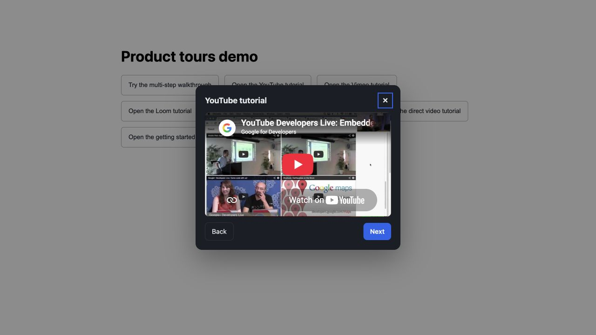
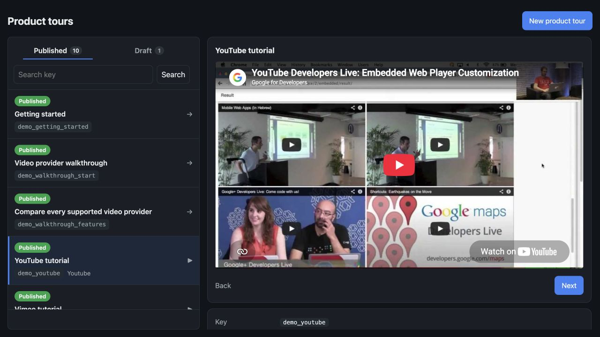
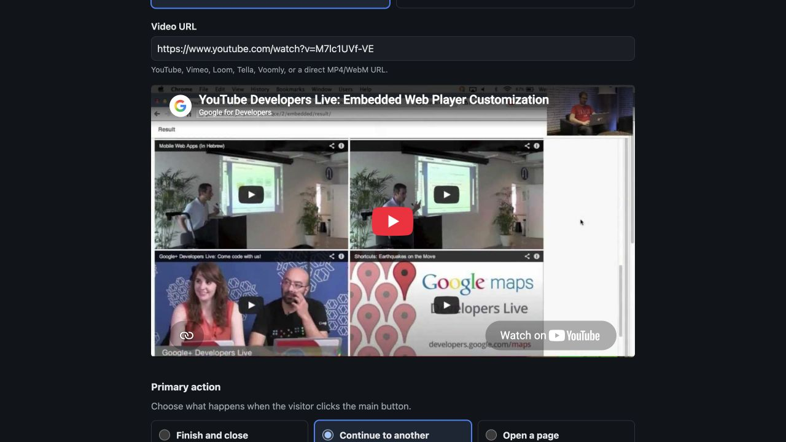
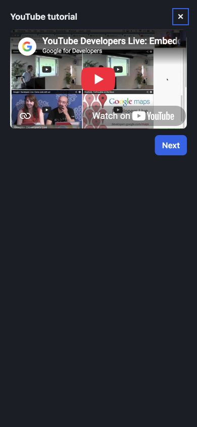

# product_tours

[](https://rubygems.org/gems/product_tours)
[](https://rubygems.org/gems/product_tours)
[](https://github.com/yshmarov/product_tours/actions/workflows/ci.yml)
[](MIT-LICENSE)
[](https://github.com/yshmarov/product_tours/stargazers)

**Self-hosted product tours and video tutorials for Rails.** Publish one useful
guide, open it from any button in your app, or link several guides into a
Next/Back walkthrough. Your content, videos, translations, and lifecycle events
stay in your Rails application.

No SaaS account. No third-party script. No visual page builder trying to attach
a tooltip to a DOM node that changed last Tuesday.



## Install

```ruby
# Gemfile
gem "product_tours"
```

```bash
bundle install
bin/rails generate product_tours:install
bin/rails db:migrate
```

```erb
<%# app/views/layouts/application.html.erb, before </body> %>
<%= product_tours_tag %>
```

Put a trigger wherever the tutorial is useful:

```erb
<button data-product-tour="billing_setup">Watch the billing guide</button>
```

That's it. Create and publish `billing_setup` at `/product_tours`, then click
your button.

The generator writes the initializer and migration, mounts the engine, and
prints copy-ready demo buttons. In development, the migration also creates a
small set of working tutorials so you can try the modal immediately.

> [!IMPORTANT]
> The dashboard defaults to **development only**. Set `authorize_admin` before
> deploying it — see [Configure](#configure).

Ruby >= 3.2 · Rails >= 7.1 · Active Storage only for uploaded videos · Action
Text only for rich descriptions.

Installing with a coding agent? Point it at [AGENTS.md](AGENTS.md) — the same
steps in the order an agent needs them, plus the gates it tends to get wrong and
the things it should not do. It ships inside the gem, so
`cat "$(bundle show product_tours)/AGENTS.md"` works from any app that bundles it.

## What you get

| | |
| --- | --- |
| **Tutorials** | Title, optional rich description, optional video, one clear primary action |
| **Walkthroughs** | Link any tutorial to another. Next opens it in place; Back uses modal history |
| **Video** | YouTube, Vimeo, Loom, Tella, Voomly, direct MP4/WebM, or an upload |
| **Dashboard** | Published/draft tabs, key search, live preview, explicit publish controls |
| **Translations** | One record per language, created from the tutorial page, with locale fallback |
| **Demo data** | Provider examples, a complete multi-step walkthrough, draft and missing-key cases |
| **Events** | `viewed`, `dismissed`, `completed` through `ActiveSupport::Notifications` |
| **Deps** | Rails only. Plain JS — no Tailwind, Stimulus, importmap, npm, CDN, or build step |
| **Auth** | Lambdas over the raw request — Devise, Rails 8 auth, anything |
| **i18n** | 26 bundled languages, including RTL |
| **Turbo/CSP** | Turbo Drive, nonce-based CSP, and supported iframe origins out of the box |

## The whole flow

1. A developer places `data-product-tour="some_key"` where help belongs.
2. An admin creates that key, adds text/video, chooses Draft or Published, and
   decides what the main button does.
3. A visitor clicks the host app's button. The gem resolves the current locale,
   opens its own modal, and emits `product_tours.viewed`.
4. The main action closes, opens an app page, or continues to another tutorial.
   Linked tutorials stay in the same modal and get a Back button automatically.

| Product-tour dashboard | Tutorial editor |
| --- | --- |
|  |  |
| The default language is the canonical list. Preview, publish, translate, or edit without a deploy. | Paste a supported URL and the preview appears immediately. Choose URL or upload, then one action. |



On screens up to 480px the modal becomes a full-screen sheet, respects safe
areas, and follows `visualViewport` while the mobile keyboard is open.

## Why a gem

| | `product_tours` | Hosted tour SaaS |
| --- | --- | --- |
| Cost | Free, MIT | Monthly, usually tied to MAU |
| Where content lives | Your database | The vendor's |
| Trigger placement | Your Rails views and product logic | A remote visual builder |
| Videos | Your URLs or Active Storage | Their upload/storage rules |
| User/account data | Not collected by the gem | Usually synced for targeting |
| Analytics | Events for the tool you already use | Another dashboard |
| Frontend | One same-origin plain-JS file | Third-party script and network calls |
| If you remove it | Delete the helper and mount | Untangle remote campaigns and targeting |

This is intentionally the reliable half of product tours: self-contained
guidance modals, not DOM-anchored tooltip choreography.

## Build a walkthrough

Every tutorial has one primary action:

| Choice | What visitors get |
| --- | --- |
| **Finish and close** | Emits `completed` and closes the modal |
| **Continue to another tutorial** | Opens that key in the same modal and adds Back history |
| **Open a page** | Emits `completed`, then follows a relative path or HTTP(S) URL |

Select **Continue to another tutorial** in the editor and pick a tutorial in the
same language. Draft targets are selectable while you assemble the walkthrough;
publish the complete chain before exposing its first trigger.

There is deliberately no Course, Tour, or Step model. Tutorials remain
independently invokable. The modal remembers only the path the current visitor
took, so opening a middle tutorial directly never shows a misleading Back
button.

## Video

Paste any supported HTTPS URL:

| Provider | Accepted examples |
| --- | --- |
| YouTube | `youtube.com/watch`, Shorts, Live, embed, `youtu.be` |
| Vimeo | Public and unlisted links; privacy hashes are preserved |
| Loom | Share and embed links |
| Tella | Video links |
| Voomly | Share, video, and embed links |
| Direct | URLs ending in `.mp4` or `.webm` |

YouTube, Vimeo, and Loom metadata comes from their oEmbed endpoints. Metadata is
best-effort: a timeout never prevents you from saving a valid URL. YouTube uses
`youtube-nocookie.com`; unsupported hosts and lookalike URLs fail closed.

Direct videos seek to an early frame for a useful preview instead of showing an
empty player.

<details>
<summary><b>Upload videos or add rich descriptions</b></summary>

Both are optional Rails features:

```bash
bin/rails active_storage:install
bin/rails action_text:install
bin/rails db:migrate
```

Once the tables exist, the editor offers **Use a video link / Upload a video**
and a compact rich-text description editor. Uploaded videos are reached through
the engine's gated media route.

</details>

## Translations

The dashboard sidebar shows only `I18n.default_locale`. Open a tutorial to see
every existing language and add another from `I18n.available_locales`.

- New product tours always start in the default locale.
- A translation copies the source into a new **draft** with the same key.
- The key and language become locked identity; translate, review, then publish.
- A trigger tries `I18n.locale`, then `I18n.default_locale` only when no current-
  locale record exists.
- A draft translation does **not** silently fall back to published English. It
  stays unavailable until you publish it.

This keeps one stable developer key while giving admins an obvious place to
manage every language.

## Demo tutorials

Development installs seed the app's default locale automatically. Refresh the
full idempotent set in English, French, and Bulgarian whenever you like:

```bash
bin/rails product_tours:seed_demo
```

The demo includes every video provider, a walkthrough through all of them, a
direct MP4, a normal URL action, an unpublished key, and an intentionally missing
key. Running the task again updates those records instead of duplicating them.

<details>
<summary><b>Copy-ready demo buttons</b></summary>

```erb
<div class="product-tours-demo">
  <button type="button" data-product-tour="demo_walkthrough_start">Try the multi-step walkthrough</button>
  <button type="button" data-product-tour="demo_youtube">Open the YouTube tutorial</button>
  <button type="button" data-product-tour="demo_vimeo">Open the Vimeo tutorial</button>
  <button type="button" data-product-tour="demo_loom">Open the Loom tutorial</button>
  <button type="button" data-product-tour="demo_tella">Open the Tella tutorial</button>
  <button type="button" data-product-tour="demo_voomly">Open the Voomly tutorial</button>
  <button type="button" data-product-tour="demo_direct_video">Open the direct video tutorial</button>
  <button type="button" data-product-tour="demo_getting_started">Open the getting started guide</button>
  <button type="button" data-product-tour="demo_draft">Try an unpublished tutorial</button>
  <button type="button" data-product-tour="demo_missing_post">Try a missing tutorial</button>
</div>
<%= product_tours_tag %>
```

</details>

## Configure

Everything is optional — a development install works with zero config. In
`config/initializers/product_tours.rb`:

| Option | Default | What it does |
| --- | --- | --- |
| `enabled` | everyone | Who can resolve and open published tutorials |
| `authorize_admin` | development only | **Who can manage content at the mount path** |
| `base_controller_class` | `ActionController::Base` | Controller the dashboard inherits — name your admin's and it adopts its layout, helpers and auth |
| `admin_layout` | gem layout | Just the shell, if you don't want the whole controller |
| `storage_service` | app default | Named Active Storage service for uploaded videos |
| `mount_path` | `/product_tours` | Keep in sync only when mounting the engine manually |

```ruby
ProductTours.configure do |config|
  config.enabled = ->(request) { request.env["warden"]&.user.present? }
  config.authorize_admin = ->(request) { request.env["warden"]&.user&.admin? }
  config.admin_layout = "admin/application"
  config.storage_service = :product_tours
end
```

Gates receive the **raw request**, so Devise, Rails 8 authentication, Flipper,
or your own session model all work without an adapter.

## Trigger it from your own UI

The gem ships no floating launcher. A trigger belongs in the navigation,
settings card, empty state, or success screen where it makes sense:

```erb
<a href="#" data-product-tour="invite_team">How team invitations work</a>
```

Keep `<%= product_tours_tag %>` in the layout when triggers appear across the
app. When `enabled` returns false, the helper renders nothing and the endpoints
also reject the request.

<details>
<summary><b>Open a tutorial after a redirect</b></summary>

The host owns timing. Rails flash plus a tiny Stimulus controller is enough:

```erb
<% if flash[:product_tour].present? %>
  <button hidden
          data-controller="product-tour-autoplay"
          data-product-tour="<%= flash[:product_tour] %>"></button>
<% end %>
```

```js
// product_tour_autoplay_controller.js in your app
connect() {
  this.element.click()
}
```

</details>

## Lifecycle events

The gem persists no analytics, user identity, cookies, progress, or completion
table. It emits three Rails notifications:

| Event | Meaning |
| --- | --- |
| `product_tours.viewed` | The modal became visible and focused |
| `product_tours.dismissed` | The visitor closed it before using the primary action |
| `product_tours.completed` | The visitor used the primary action |

Payload: `post_id`, `key`, `locale`, query-free `page_url`, and `source`.

Bridge them to Ahoy—or anything else—in your host app:

```ruby
ActiveSupport::Notifications.subscribe(/^product_tours\./) do |name, _start, _finish, _id, payload|
  Ahoy.track(name.delete_prefix("product_tours."), payload.slice(:key, :locale, :source))
end
```

Your subscriber can attach `Current.user` or account context. That identity does
not need to become product-tour configuration.

## Broken triggers fail loudly, not publicly

`data-product-tour="key"` is a contract between code and dashboard content.
Invalid, missing, draft, or disabled keys open nothing for the visitor.

- Development/test: raises `ProductTours::UnresolvedTriggerError`.
- Production: reports through `Rails.error`, logs as a fallback, and emits
  `product_tours.unresolved_trigger` with `invalid_key`, `missing`,
  `unpublished`, or `disabled`.

No end user gets a Rails error page because somebody renamed a tutorial.

## Security

- Admin authorization runs server-side on every dashboard request.
- Public resolution returns only published tutorials allowed by `enabled`.
- Video providers are an HTTPS allowlist; unsupported URLs render no iframe.
- Action URLs accept relative app paths or HTTP(S), never script schemes.
- Widget/dashboard assets are same-origin and fingerprinted.
- Rails CSP nonces are preserved. Supported provider origins are merged into
  `frame-src` without replacing the host policy.
- For direct videos on another origin, allow that origin in the host app's
  `media-src` policy.

## What it doesn't do

No anchored tooltips, selector recorder, page-rule engine, automatic scheduler,
checklists, persisted progress, analytics dashboard, resource center, AI writer,
Segment/Mixpanel/Slack integration, or user/account sync.

The host app owns trigger timing and Help navigation. Ahoy or your analytics
stack owns persistence and reporting. The gem stays small enough to understand.

## Development

```bash
bundle exec rake test
bundle exec rubocop
```

CI runs Rails 7.1 / 7.2 / 8.0 / 8.1 against Ruby 3.2 / 3.3 / 3.4.

Bug reports and pull requests are welcome. The most useful report is a real
Rails app and the exact point where installation or authoring felt confusing.

## One family

Five Rails engines built on the same backbone, so adopting a second one is
mostly muscle memory:

| Gem | What it does |
| --- | --- |
| [testimonials](https://github.com/yshmarov/testimonials) | Testimonials, reviews and NPS — text and video, collected in your own app |
| [ideasbugs](https://github.com/yshmarov/ideasbugs) | In-app bug reports and feature requests, with a triage queue |
| [livechat](https://github.com/yshmarov/livechat) | Live chat between your visitors and your agents, self-hosted |
| **product_tours** *(this gem)* | Product tours and video tutorials, shown in-app at the right moment |
| [i18n_proofreading](https://github.com/yshmarov/i18n_proofreading) | In-context translation fixes suggested by your own users |

They share the install shape (`generate <gem>:install`, mount, one initializer),
the same host hooks (`base_controller_class` to inherit your admin's controller,
`admin_layout` for just the shell), one dashboard design system — the same
two-pane layout, colour tokens and components in all five, scoped so it cannot
touch your own CSS — and migrations that follow your app's `primary_key_type`.

## License

MIT. If it saved you a subscription, a
[⭐](https://github.com/yshmarov/product_tours) is a fair trade.
